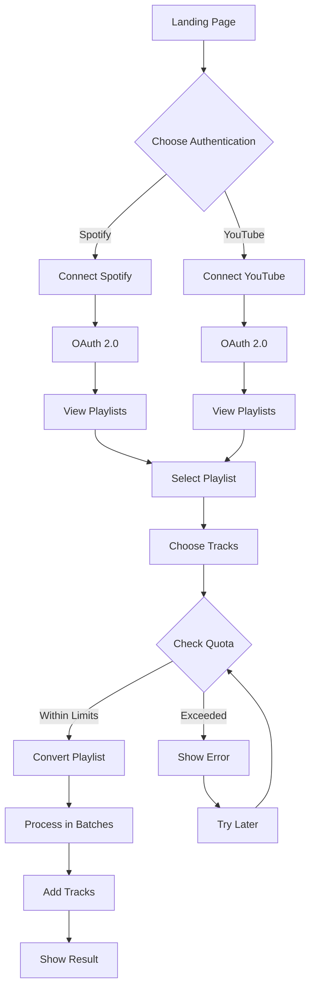

# Playlist Transfer

**Playlist Transfer** is a web application that allows users to seamlessly transfer their playlists between Spotify and YouTube. With just a few clicks, you can move your favorite tracks from one platform to the other, ensuring you have access to your music wherever you go.

## Features

- **OAuth Authentication**: Securely log in to your Spotify and YouTube accounts using OAuth.
- **Playlist Transfer**: Easily transfer playlists from Spotify to YouTube or from YouTube to Spotify.
- **Seamless Integration**: Uses the Spotify Web API and YouTube Data API v3 to fetch and manage playlists.
- **User-Friendly Interface**: A simple and intuitive interface built with Thymeleaf.
- **Cloud Deployment on AWS**: Deployed on AWS EC2 with Nginx reverse proxy and SSL, demonstrating hands-on experience with AWS cloud infrastructure, server provisioning, and production DevOps.

## Technologies Used

- **Java**: The core programming language used for backend logic.
- **Spring Boot**: Framework for building the backend services.
- **Thymeleaf**: Used for server-side rendering of the frontend.
- **Spotify Web API**: Fetches and manages Spotify playlists.
- **YouTube Data API v3**: Fetches and manages YouTube playlists.
- **AWS EC2**: Cloud hosting for scalable and reliable deployment.
- **Nginx**: Reverse proxy and SSL termination.

## YouTube API Quota Information
- Create playlist: 50 units
- Search for video: 100 units per search
- Add video to playlist: 50 units per addition
- Daily total limit: 10,000 units

For a 10-track playlist conversion:
- Playlist creation: 50 units
- 10 searches: 1000 units
- 10 additions: 500 units
- Total: ~1550 units per conversion

This allows approximately 6-7 playlist conversions per day while staying within quota limits.

## Setup Instructions

1. Clone the repository:
```bash
git clone https://github.com/yourusername/PlaylistConverter.git
cd PlaylistConverter
```

2. Configure API Credentials:
   - Create a Spotify Developer account and get API credentials
   - Create a Google Cloud Project and enable YouTube Data API v3
   - Update `src/main/resources/application.properties` with your credentials

3. Set environment variables (for Codespaces):
```bash
export REDIRECT_URI=https://your-codespace-name-3000.app.github.dev
```

4. Build and run the project:
```bash
chmod +x mvnw
./mvnw clean install
./mvnw spring-boot:run
```

5. Access the application:
   - Local: http://localhost:3000
   - Codespaces: https://your-codespace-name-3000.app.github.dev

## Usage Tips
1. Start with smaller playlists (up to 10 tracks) to manage quota limits
2. Allow delays between conversions (built into the application)
3. Monitor your YouTube API quota usage in Google Cloud Console
4. For larger playlists, consider breaking them into smaller chunks

## Troubleshooting
- If conversion fails, check the YouTube API quota in Google Cloud Console
- Ensure all redirect URIs match exactly in both API dashboards
- Clear browser cache if authentication issues occur
- Check application logs for detailed error messages

## Project Flow



## Extended Documentation

### API Integration
Detailed API documentation can be found in our [API Docs](docs/README.md).

### Technical Architecture
View our detailed system architecture in the [Architecture Documentation](docs/ARCHITECTURE.md).

### Support and Community
- Technical Support: [Support Guide](docs/SUPPORT.md)
- Email Templates: [Email Templates](docs/emails/TEMPLATES.md)
- Community Guidelines: [Contributing](CONTRIBUTING.md)
- Privacy Policy: [Privacy Policy](docs/PRIVACY.md)

### Development Setup
For detailed development setup instructions, visit our [Wiki](wiki/WIKI.md).

### Application Flow Explanation

1. **User Authentication Flow**:
   - User starts at landing page
   - Chooses conversion direction (Spotify → YouTube or YouTube → Spotify)
   - Authenticates with source platform using OAuth
   - Authenticates with destination platform

2. **Spotify to YouTube Conversion**:
   - User logs in to Spotify (OAuth)
   - Views list of Spotify playlists
   - Selects playlist to convert
   - Chooses specific tracks
   - System creates YouTube playlist
   - For each track:
     * Searches YouTube for best match
     * Adds video to playlist
   - Shows result with YouTube playlist link

3. **YouTube to Spotify Conversion**:
   - User logs in to YouTube (OAuth)
   - Views list of YouTube playlists
   - Selects playlist to convert
   - Chooses specific tracks
   - System creates Spotify playlist
   - For each track:
     * Searches Spotify for best match
     * Adds track to playlist
   - Shows result with Spotify playlist link

4. **API Quota Management**:
   - YouTube API daily limits:
     * Create playlist: 50 units
     * Search: 100 units/search
     * Add track: 50 units/addition
   - Batch processing for efficiency
   - Delays between API calls
   - Maximum 10 tracks per conversion

5. **Error Handling**:
   - OAuth authentication errors
   - API quota exceeded
   - Track not found
   - Network issues
   - Rate limiting

## Usage Flow
1. **Landing Page**: Connect your accounts
   

2. **Service Connection**: Choose your platforms
   

3. **Authentication**: Login to your accounts
   

4. **View Playlists**: Select from your playlists
   
   


## Community
- Check out our [Contributing Guidelines](https://github.com/tejuiceB/PlaylistConverter/blob/main/CONTRIBUTING.md)


