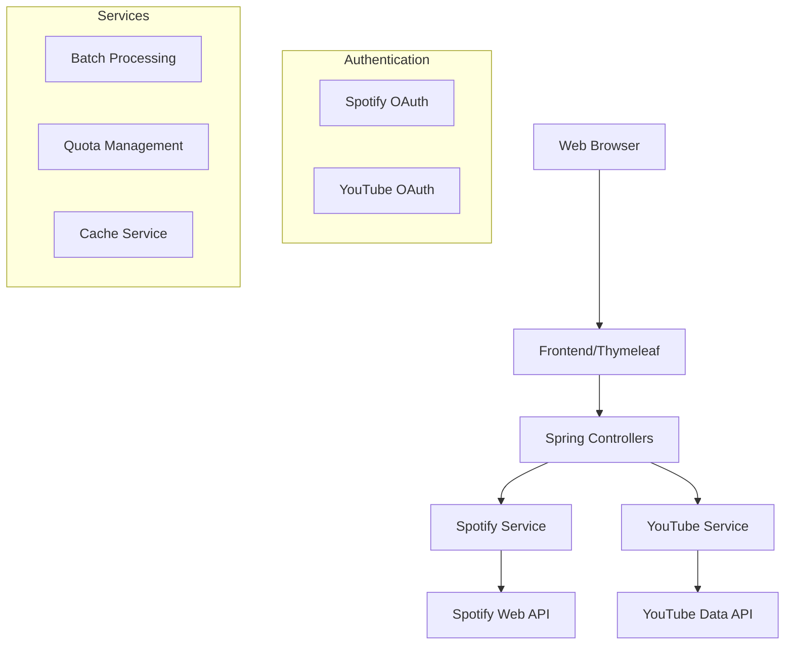

# PlaylistConverter Architecture

## System Overview

## Component Details

### Frontend Layer
- Thymeleaf templates
- Bootstrap 4.5.2
- Responsive design
- Session management

### Controller Layer
- REST endpoints
- Request validation
- Error handling
- Session management

### Service Layer
- Spotify integration
- YouTube integration
- Batch processing
- Quota management

### External APIs
- Spotify Web API
- YouTube Data API v3
- OAuth 2.0 authentication

## Data Flow

1. User Authentication
2. Playlist Selection
3. Track Processing
4. Batch Conversion
5. Result Display

## Security Measures

- OAuth 2.0 implementation
- Token management
- Rate limiting
- Input validation

## Performance Optimization

- Batch processing
- Caching mechanisms
- Quota management
- API call optimization
